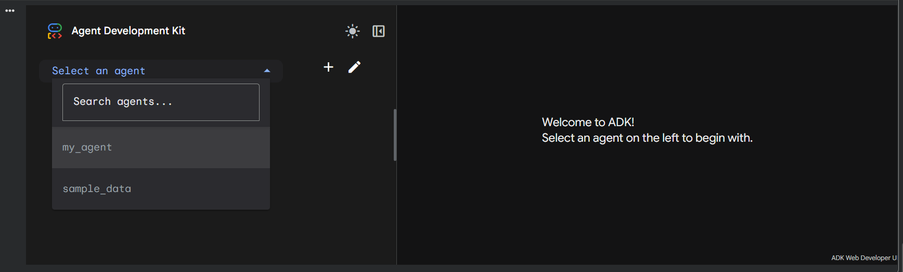
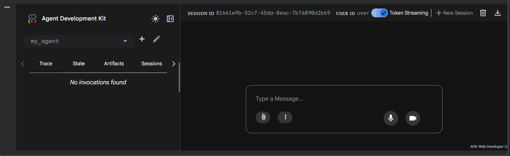
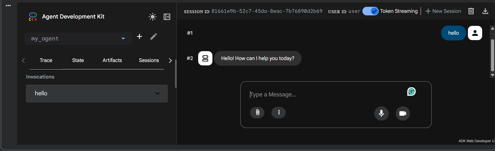

# ADK Agent with Google Search & Gemini
This project demonstrates how to build and run an AI agent using the Google Agent Development Kit (ADK). It leverages the Gemini 2.5 Flash model and is equipped with the Google Search Tool for real-time information retrieval.

## 🚀 Overview
The repository contains the scaffolding for an ADK agent designed to be developed in Google Colab and deployed on ADK Web.

## 🛠️ Prerequisites
A Google Cloud Project with the Gemini API enabled: Create a project on Google Cloud Platform (GCP): https://developers.google.com/workspace/guides/create-project

A valid GOOGLE_API_KEY: Create a Google API key via Google AI Studio: https://ai.google.dev/gemini-api/docs/api-key

## 📥 Getting Started

### 1. Environment Setup

Install the required Google Packages

### 2. Configure API Credentials
To interact with Gemini, you need a valid Google API Key. In your environment (or Colab), set this securely: You can obtain your key from the Google AI Studio.

### 3. Initialize the Agent
Generate the agent scaffold using the ADK CLI. run:
!adk create my_agent
Configuration during setup:

When prompted for a model, you selected "2. Other models" to manually configure the agent for Gemini 2.5 Flash or Gemini 3 later in the agent.py configuration.

### 4. Code Integration
The command above creates a folder named my_agent.

Open my_agent/agent.py.

Insert the agent logic from the agent.py in the repository into your agent.py file.

### 5. Launch & Interact
You can run the agent in the terminal for testing or launch the ADK Web UI.

## 🖥️ Usage
Launch Web Interface
Interact with your agent via a visual chat interface:

## 📚 Resources & Documentation
To further explore ADK capabilities, refer to these trusted platforms:

My Session on Youtube: https://www.youtube.com/watch?v=hIZsbN5LIRw&t=17s

ADK Doc: https://google.github.io/adk-docs/

ADK Course: https://codelabs.developers.google.com/onramp/instructions

Learning Path: https://www.skills.google/course_templates/1382

## 🌟 Show your support
Give a ⭐️ if this project helped you learn ADK!
